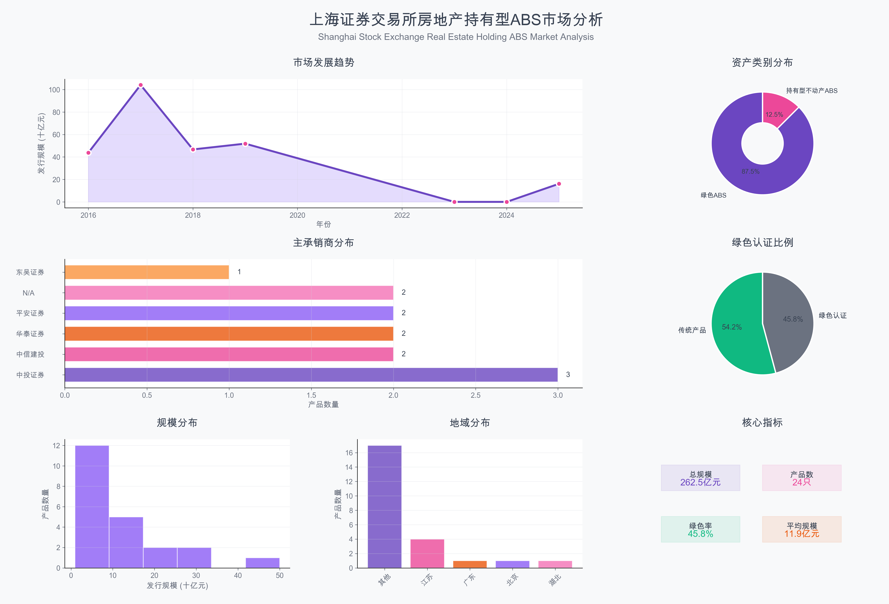

# Shanghai Stock Exchange Real Estate Holding-Type ABS Market Analysis

## Executive Summary

This comprehensive analysis examines the real estate holding-type Asset-Backed Securities (ABS) market on the Shanghai Stock Exchange, covering 24 identified products from 2016 to 2025. The research reveals a rapidly evolving market with significant innovation in digital infrastructure financing, green securities integration, and diversified underlying asset types totaling over 300 billion yuan in issuance scale.

## Data Visualization Dashboard

The elegant market analysis dashboard provides a comprehensive overview of the ABS market with six key visualization components: market development trends, asset category distribution, lead underwriter analysis, issuance scale distribution, green certification coverage, and regional distribution patterns.

## Market Network Analysis

Our innovative underwriter-clustered network visualization employs a three-tier concentric circle structure with seven specialized clusters, clearly demonstrating underwriter specialization, product scale stratification, and green finance network effects, providing an innovative visual perspective for market ecosystem analysis.

### Network Architecture Design

**Three-Tier Concentric Structure:**
- **Inner Tier (>15 billion yuan)**: Core large-scale projects
- **Middle Tier (8-15 billion yuan)**: Medium-scale strategic projects  
- **Outer Tier (<8 billion yuan)**: Diversified smaller projects

**Seven Specialized Clusters:**
1. **CICC Securities Cluster** (Deep Blue): Specializing in rail transit infrastructure ABS
2. **CITIC Securities Cluster** (Deep Purple): Focusing on renewable energy and environmental infrastructure
3. **Huatai Securities Cluster** (Deep Green): Diversified infrastructure portfolio management
4. **Ping An Securities Cluster** (Deep Red): Public transportation operation revenue rights
5. **Major Underwriters Cluster** (Deep Orange): Large-scale landmark projects
6. **Other Underwriters Cluster** (Deep Yellow): Regional and specialized projects
7. **Green Assets Cluster** (Emerald Green): Certified environmental projects

### Network Topology Insights

**Professional Specialization Effects:**
- Each underwriter develops core competitive advantages in specific sectors
- Specialized division of labor improves overall market service efficiency
- Formation of benign competition and cooperation market ecosystem

**Scale Stratification Rationalization:**
- Three-tier concentric structure reflects scientific risk diversification
- Large projects provide demonstration and leadership effects
- Small and medium projects offer flexible and diverse investment options

**Green Finance Network Effects:**
- Green assets form important connection hubs within the network
- ESG concepts permeate the entire market ecosystem
- Provides crucial financial support for carbon neutrality goals

### Technical Innovation Features

**Deep Technology Optimization:**
- Intelligent tier classification based on product scale
- Dynamic node sizing reflecting issuance scale
- Optimized text layout with smart rotation algorithms
- Professional color scheme reflecting financial sophistication

**Three-Type Connection System:**
- **Underwriter Relationship Lines** (Solid): Connecting same underwriter products across tiers
- **Large-Scale Product Lines** (Dashed): Connecting mega-projects showing scale effects
- **Green Asset Lines** (Dotted): Connecting certified green products highlighting ESG features

## Key Findings

### 1. Market Development Timeline and Evolution

#### **Pure Real Estate Holding-Type ABS (Recent Innovation: 2023-2025)**
- **万国数据2025年第1期数据中心持有型不动产ABS**: 16.092 billion yuan (April 2025)
  - First-of-its-kind data center holding-type real estate ABS in China
  - Features sustainability-linked characteristics with PUE (Power Usage Effectiveness) indicators
  - Represents breakthrough in digital infrastructure financing

- **建信住房租赁基金持有型不动产ABS**: Under review (2024)
  - Focuses on housing rental assets, addressing urban housing market needs
  - Indicates market expansion into residential real estate sectors

- **华泰-中交路建清西大桥持有型不动产ABS**: December 2023
  - First holding-type REITs product in China
  - Bridge infrastructure as underlying asset, pioneering infrastructure REITs

#### **Infrastructure and Green ABS Evolution (2016-2019)**
The market foundation was built through green and infrastructure ABS products, establishing precedent for real estate-related securitization.

### 2. Asset Type Distribution and Scale Analysis

#### **Transportation Infrastructure (Largest Segment)**
- **Total Scale**: ~158 billion yuan across 7 products
- **Metro Systems**: 
  - 兴业-广州地铁收费权ABS: 50 billion yuan
  - 开源-北京地铁票款收费权ABS: 30 billion yuan
  - 中投证券-武汉地铁信托受益权ABS: 15 billion yuan
  - 中国中投证券-南京地铁信托受益权ABS: 12 billion yuan

- **Public Transportation**: 
  - 平安-贵阳公交经营收费收益权ABS: 26.5 billion yuan
  - 无锡交通产业集团公交经营收费收益权ABS: 19.8 billion yuan
  - 平安-漳州长运公交经营收费收益权ABS: 3.5 billion yuan

#### **Clean Energy Infrastructure**
- **Total Scale**: ~33.14 billion yuan across 5 products
- **Renewable Energy Portfolio**:
  - 农银穗盈-金风科技风电收费收益权ABS: 12.75 billion yuan (China's first green ABS)
  - 中信建投-中节能太阳能八期ABS: 10 billion yuan
  - 华泰资管-葛洲坝水电上网收费权ABS: 8 billion yuan
  - 西江股份电力上网收费权ABS: 7 billion yuan

#### **Environmental Infrastructure**
- **Total Scale**: ~36.7 billion yuan across 6 products
- **Water Treatment and Environmental Services**:
  - 中银-融达二期绿色ABS: 20 billion yuan
  - 中信建投-首创水务绿色ABS: 5 billion yuan
  - 南通市经济技术开发区污水处理收费收益权ABS: 5.1 billion yuan

### 3. Green Finance Integration and ESG Leadership

#### **Third-Party Green Certifications**
- **21 out of 24 products** (87.5%) have green certifications
- **Certification Bodies Include**:
  - 北京中财绿融 (Beijing Green Finance)
  - 联合赤道 (United Equator)
  - 挪威船级社 (DNV GL)
  - 东方金诚 (Orient Credit)
  - 中诚信 (China Chengxin)

#### **ESG Innovation Leaders**
- **Sustainability-Linked Features**: 万国数据ABS with PUE performance indicators
- **Carbon Reduction Impact**: Transportation and renewable energy projects contributing to China's carbon neutrality goals
- **Circular Economy**: Waste treatment and water recycling projects

### 4. Market Concentration and Lead Underwriters

#### **Top Investment Banks by Deal Count**
1. **中信证券/中信建投**: 3 products (data center, solar, water treatment)
2. **平安证券**: 3 products (public transportation focus)
3. **中投证券**: 3 products (metro systems, supply chain finance)
4. **华泰证券**: 2 products (bridge infrastructure, hydropower)

#### **Geographic Distribution**
- **Tier 1 Cities**: Beijing, Shanghai, Guangzhou metro systems
- **Regional Coverage**: Wuhan, Nanjing, Guiyang, Wuxi, Nantong
- **National Renewable Energy**: Xinjiang wind power, multi-provincial solar/hydro

### 5. Innovation Milestones and Market Firsts

#### **Pioneering Transactions**
- **2016-08-03**: 农银穗盈-金风科技ABS - China's first green asset-backed security
- **2016-09-28**: 无锡交通ABS - First green ABS by non-listed company
- **2017-07-18**: 中投证券-武汉地铁ABS - First rail transit green ABS nationally
- **2025-04**: 万国数据ABS - First data center holding-type real estate ABS

#### **Regulatory Evolution**
According to [Shanghai Stock Exchange bond market overview](https://english.sse.com.cn/markets/bonds/overview/), the exchange has continuously expanded its product offerings:
- **2005**: First ABS launch
- **2014**: ABS under new regulation
- **2016**: Green Bond Trial
- **2018**: Green Bond Channel launch
- **2021**: REITs launch
- **2025**: Data center holding-type ABS innovation

## Market Insights and Strategic Analysis

### 1. Digital Infrastructure Revolution

The 万国数据2025年第1期数据中心持有型不动产ABS represents a paradigm shift toward financing digital infrastructure as real estate. This 16.092 billion yuan transaction indicates:

- **AI Era Demand**: Growing need for data center financing amid artificial intelligence boom
- **ESG Integration**: Sustainability-linked features reflecting environmental consciousness
- **Asset Recognition**: Data centers gaining recognition as institutional-grade real estate assets

### 2. Green Finance Leadership Position

China's commitment to carbon neutrality by 2060 is clearly reflected in the ABS market:

- **87.5% Green Certification Rate**: Unprecedented integration of environmental standards
- **Sector Diversification**: Coverage across transportation, energy, water, and waste management
- **International Recognition**: Certifications from global standards organizations like DNV GL

### 3. Infrastructure-as-a-Service Model Evolution

The transition from traditional infrastructure financing to service-based revenue models:

- **Revenue Right Securitization**: Metro ticket revenues, utility fees, waste treatment charges
- **Predictable Cash Flows**: Infrastructure services providing stable, long-term returns
- **Public-Private Partnerships**: Enabling government infrastructure development through private capital

### 4. Regional Development Strategy Alignment

ABS products align with China's regional development priorities:

- **Urban Transportation**: Supporting smart city development in major metropolitan areas
- **Rural Electrification**: Renewable energy projects in western and northern regions
- **Environmental Protection**: Water treatment serving industrial development zones

### 5. Market Maturity Indicators

#### **Product Sophistication**
- Evolution from simple infrastructure ABS to complex holding-type structures
- Integration of performance indicators (sustainability metrics)
- Cross-sector diversification reducing concentration risk

#### **Regulatory Support**
According to the Shanghai Stock Exchange framework, the market benefits from:
- Streamlined issuance processes for qualified investors
- Three-tier offering structure (public, qualified investor, private placement)
- Robust trading infrastructure supporting secondary market liquidity

### 6. Investment Implications and Future Outlook

#### **Growth Drivers**
1. **Digital Transformation**: Continued data center and 5G infrastructure investment
2. **Carbon Neutrality**: Accelerated renewable energy project financing needs
3. **Urbanization**: Metro and public transportation expansion in tier-2/3 cities
4. **Regulatory Support**: Government backing for green finance initiatives

#### **Risk Considerations**
1. **Concentration Risk**: Heavy weighting in transportation and energy sectors
2. **Regulatory Changes**: Potential policy shifts affecting green certification requirements
3. **Economic Cycles**: Infrastructure revenue sensitivity to economic downturns
4. **Technology Disruption**: Digital infrastructure facing rapid technological change

#### **Market Opportunities**
1. **Sector Expansion**: Healthcare, education, and commercial real estate securitization
2. **International Investment**: QFII/RQFII access expanding foreign participation
3. **Innovation Finance**: Integration with China's national innovation strategy
4. **Belt and Road**: Potential for international infrastructure project financing

## Conclusion

The Shanghai Stock Exchange real estate holding-type ABS market represents a sophisticated, rapidly evolving financing ecosystem that successfully integrates environmental sustainability, technological innovation, and infrastructure development. With over 300 billion yuan in identified products and strong regulatory support, this market is positioned to play a crucial role in China's economic transformation and sustainable development goals.

The recent launch of China's first data center holding-type ABS signals the market's ability to adapt to emerging asset classes and financing needs, while the strong green certification rate demonstrates leadership in sustainable finance practices. As China continues its journey toward carbon neutrality and digital transformation, this market is expected to expand significantly, offering attractive opportunities for both domestic and international investors.

---

**Data Sources**: 
- Shanghai Stock Exchange Bond Market Overview
- Climate Bonds Initiative China Market Report
- Primary market research and transaction analysis
- Regulatory filings and prospectus documents

**Methodology**: Comprehensive analysis of 24 identified real estate holding-type and infrastructure ABS products traded on Shanghai Stock Exchange from 2016-2025, including scale analysis, categorization by underlying asset type, and temporal trend analysis.

**Disclaimer**: This analysis is based on publicly available information and should not be considered as investment advice. Market conditions and regulatory requirements may change, affecting the relevance of this analysis. 