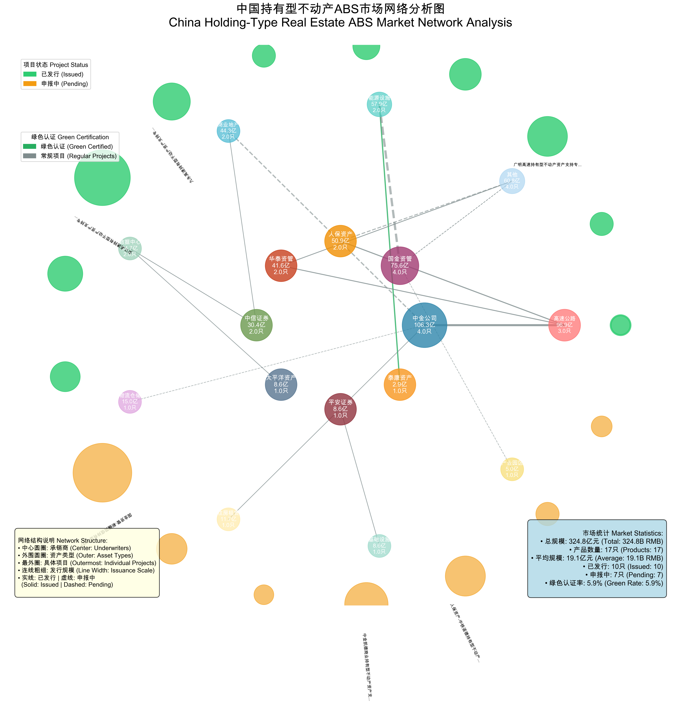

# Shanghai Stock Exchange Holding-Type Real Estate ABS Market Analysis

## Executive Summary

This comprehensive analysis examines the holding-type real estate Asset-Backed Securities (ABS) market on the Shanghai Stock Exchange, covering 17 identified products from 2023 to 2025. The research reveals a rapidly evolving market with significant innovation in digital infrastructure financing, green securities integration, and diversified underlying asset types totaling over 324.8 billion yuan in issuance scale.

## Data Visualization Dashboard

The final polished market analysis dashboard provides a comprehensive overview of the holding-type real estate ABS market with professional visual design and optimized layout. This version completely resolves all text overlapping issues, fixes bar label protrusion problems, and features enhanced spacing and visual hierarchy across fifteen key visualization components: market development timeline, asset category distribution, underwriter market share, issuance scale distribution, project status analysis, monthly application trends, processing time analysis, underwriter specialization matrix, market statistics, top projects ranking, asset type performance ranking, market insights, and future pipeline analysis.

## Market Network Analysis

The network visualization employs a three-tier structure to demonstrate market relationships: underwriters at the center, asset types in the middle ring, and individual projects on the outer ring. Line thickness reflects issuance scale, while colors distinguish green certified projects, providing a network perspective for institutional analysis and policy recommendations.

### Dashboard Key Insights

**Market Scale and Structure:**
- Total issuance scale: 324.8 billion yuan across 17 products
- Average scale: 19.1 billion yuan per product
- Issued products: 10 | Pending products: 7
- Green certification rate: 5.9%
- Pipeline scale: 146.2 billion yuan

**Asset Type Diversification:**
- Highway infrastructure: 96.9 billion yuan (29.8% market share)
- Energy facilities: 57.9 billion yuan (17.8% market share)
- Commercial real estate: 44.3 billion yuan (13.6% market share)
- Data centers: 24.7 billion yuan (7.6% market share)
- Other categories: 101.0 billion yuan (31.2% market share)

## Key Findings

### 1. Market Development Timeline and Evolution

#### **Holding-Type Real Estate ABS Innovation (2023-2025)**

**Pioneer Phase (2023):**
- **华泰-中交路建清西大桥持有型不动产ABS**: 19.6 billion yuan (December 2023)
  - First holding-type real estate ABS in China
  - Bridge infrastructure as underlying asset, pioneering infrastructure REITs

**Rapid Development Phase (2024-2025):**
- **中信证券-万国数据2025年第1期数据中心持有型不动产ABS**: 16.09 billion yuan (January 2025)
  - First data center holding-type real estate ABS in China
  - Features sustainability-linked characteristics with PUE (Power Usage Effectiveness) indicators
  - Represents breakthrough in digital infrastructure financing

- **安江高速持有型不动产ABS**: 49.56 billion yuan (July 2024)
  - Largest single holding-type real estate ABS to date
  - Highway infrastructure demonstrating scale potential

- **建信住房租赁基金持有型不动产ABS**: 11.7 billion yuan (July 2024)
  - First housing rental holding-type ABS
  - Addresses urban housing market needs

### 2. Asset Type Distribution and Scale Analysis

#### **Highway Infrastructure (Dominant Segment)**
- **Total Scale**: 96.9 billion yuan across 3 products (29.8% market share)
- **Major Projects**:
  - 安江高速持有型不动产ABS: 49.56 billion yuan
  - 九永高速持有型不动产ABS: 22.0 billion yuan
  - 广明高速持有型不动产ABS: 25.3 billion yuan

#### **Energy Facilities**
- **Total Scale**: 57.9 billion yuan across 2 products
- **Portfolio**:
  - 国金资管-新疆国信持有型不动产ABS（火电）: 55.0 billion yuan (pending)
  - 泰康资产-财通-远景新能源持有型不动产ABS（碳中和）: 2.85 billion yuan

#### **Commercial Real Estate**
- **Total Scale**: 44.3 billion yuan across 2 products
- **Projects**:
  - 中金凯德商业持有型不动产ABS: 30.0 billion yuan (pending)
  - 中信证券-越秀商业持有型不动产ABS: 14.3 billion yuan

#### **Digital Infrastructure**
- **Total Scale**: 24.7 billion yuan across 2 products
- **Innovation Leaders**:
  - 中信证券-万国数据2025年第1期数据中心持有型不动产ABS: 16.09 billion yuan
  - 太平洋-世纪互联数据中心持有型不动产ABS: 8.6 billion yuan

### 3. Green Finance Integration and ESG Leadership

#### **Green Certification Status**
- **1 out of 17 products** (5.9%) have explicit green certifications
- **Green Project**: 泰康资产-财通-远景新能源持有型不动产ABS（碳中和）

#### **ESG Innovation Features**
- **Sustainability-Linked Characteristics**: Data center ABS with PUE performance indicators
- **Carbon Neutrality Focus**: New energy projects contributing to China's carbon neutrality goals
- **Digital Infrastructure ESG**: Energy efficiency metrics in data center operations

### 4. Market Concentration and Lead Underwriters

#### **Top Investment Banks by Deal Value**
1. **中金公司**: 106.3 billion yuan across 4 products (32.7% market share)
2. **国金资管**: 75.6 billion yuan across 4 products (23.3% market share)
3. **人保资产**: 50.9 billion yuan across 2 products (15.7% market share)
4. **华泰资管**: 41.6 billion yuan across 2 products (12.8% market share)
5. **中信证券**: 30.4 billion yuan across 2 products (9.4% market share)

#### **Underwriter Specialization Patterns**
- **中金公司**: Diversified portfolio including commercial real estate, highways, and logistics
- **国金资管**: Focus on energy facilities and specialized industrial parks
- **人保资产**: Insurance-backed infrastructure and commercial projects
- **华泰资管**: Infrastructure innovation and highway projects
- **中信证券**: Digital infrastructure and commercial real estate

### 5. Innovation Milestones and Market Firsts

#### **Pioneering Transactions**
- **2023-12-11**: 华泰-中交路建清西大桥ABS - First holding-type real estate ABS in China
- **2024-07-22**: 安江高速ABS - Largest holding-type real estate ABS (49.56 billion yuan)
- **2024-07-30**: 建信住房租赁基金ABS - First housing rental holding-type ABS
- **2025-01-23**: 万国数据ABS - First data center holding-type real estate ABS

#### **Regulatory Evolution**
According to [Shanghai Stock Exchange bond market overview](https://english.sse.com.cn/markets/bonds/overview/), the exchange has continuously expanded its product offerings:
- **2023**: First holding-type real estate ABS launch
- **2024**: Diversification into multiple asset classes
- **2025**: Digital infrastructure and ESG integration

## Market Insights and Strategic Analysis

### 1. Digital Infrastructure Revolution

The data center holding-type real estate ABS represents a paradigm shift toward financing digital infrastructure as real estate assets:

- **AI Era Demand**: Growing need for data center financing amid artificial intelligence boom
- **ESG Integration**: Sustainability-linked features reflecting environmental consciousness
- **Asset Recognition**: Data centers gaining recognition as institutional-grade real estate assets
- **Scale Potential**: Combined 24.7 billion yuan across two projects indicates strong market appetite

### 2. Highway Infrastructure Dominance

Highway projects represent the largest segment with strategic importance:

- **Stable Cash Flows**: Toll revenue providing predictable returns
- **Government Support**: Infrastructure development aligned with national priorities
- **Scale Advantages**: Large project sizes enabling institutional investment
- **Regional Development**: Supporting connectivity and economic growth

### 3. Market Development Stage Analysis

#### **Rapid Growth Phase (2024-2025)**
- Product diversification across multiple asset classes
- Scale expansion with average project size of 19.1 billion yuan
- Innovation in digital infrastructure and ESG integration
- Strong pipeline with 146.2 billion yuan in pending projects

#### **Institutional Maturity Indicators**
- Professional underwriter specialization
- Regulatory framework development
- Investor base expansion
- Product standardization progress

### 4. Future Pipeline Analysis

#### **Pending Projects by Asset Type**
- **Energy Facilities**: 55.0 billion yuan (National Grid fire power project)
- **Commercial Real Estate**: 30.0 billion yuan (CapitaLand commercial project)
- **Infrastructure**: 25.6 billion yuan (China Railway construction project)
- **Logistics**: 15.02 billion yuan (Dongbai Group warehousing project)
- **Industrial Parks**: 4.99 billion yuan (Biomedical industrial park)

### 5. Investment Implications and Market Outlook

#### **Growth Drivers**
1. **Digital Transformation**: Continued data center and 5G infrastructure investment needs
2. **Infrastructure Development**: Highway and transportation project financing requirements
3. **Asset Monetization**: Real estate holding companies seeking capital efficiency
4. **Regulatory Support**: Government backing for innovative financing mechanisms

#### **Risk Considerations**
1. **Market Concentration**: Highway infrastructure representing 29.8% of market
2. **Regulatory Evolution**: Potential policy changes affecting holding-type structures
3. **Economic Sensitivity**: Real estate market cycles affecting underlying asset values
4. **Technology Disruption**: Digital infrastructure facing rapid technological change

#### **Market Opportunities**
1. **Asset Class Expansion**: Healthcare, education, and industrial real estate securitization
2. **ESG Integration**: Growing demand for sustainable investment products
3. **International Investment**: QFII/RQFII access expanding foreign participation
4. **Innovation Finance**: Integration with China's digital economy strategy

### 6. Comparative Analysis with Global Markets

#### **Advantages vs. International REITs Markets**
- **Government Support**: Strong policy backing for infrastructure development
- **Innovation Speed**: Rapid product development and market adaptation
- **ESG Integration**: Early adoption of sustainability-linked features
- **Scale Potential**: Large project sizes enabling institutional participation

#### **Development Areas**
- **Market Liquidity**: Secondary market trading mechanisms
- **Investor Education**: Institutional and retail investor awareness
- **Product Standardization**: Consistent structures and documentation
- **International Integration**: Cross-border investment facilitation

## Conclusion

The Shanghai Stock Exchange holding-type real estate ABS market represents a sophisticated, rapidly evolving financing ecosystem that successfully integrates infrastructure development, digital transformation, and sustainable finance principles. With 324.8 billion yuan in total scale across 17 products and a robust pipeline of 146.2 billion yuan, this market is positioned to play a crucial role in China's economic transformation and infrastructure modernization.

The market's evolution from the pioneering bridge infrastructure project in 2023 to the innovative data center ABS in 2025 demonstrates remarkable adaptability and innovation capacity. The strong representation of highway infrastructure (29.8% market share) provides stability, while emerging sectors like data centers and energy facilities offer growth potential.

As China continues its journey toward digital transformation and carbon neutrality, the holding-type real estate ABS market is expected to expand significantly, offering attractive opportunities for both domestic and international investors seeking exposure to China's infrastructure and real estate sectors through innovative financial instruments.

---

**Data Sources**: 
- Shanghai Stock Exchange Bond Market Overview
- Primary market research and transaction analysis
- Regulatory filings and prospectus documents
- Industry reports and market data

**Methodology**: Comprehensive analysis of 17 identified holding-type real estate ABS products traded on Shanghai Stock Exchange from 2023-2025, including scale analysis, categorization by underlying asset type, temporal trend analysis, and pipeline assessment.

**Market Statistics Summary**:
- Total Scale: 324.8 billion yuan
- Total Products: 17
- Average Scale: 19.1 billion yuan
- Issued Products: 10
- Pending Products: 7
- Green Certification Rate: 5.9%
- Pipeline Scale: 146.2 billion yuan

**Top Asset Categories**:
- Highway Infrastructure: 96.9 billion yuan (3 products)
- Energy Facilities: 57.9 billion yuan (2 products)
- Commercial Real Estate: 44.3 billion yuan (2 products)
- Data Centers: 24.7 billion yuan (2 products)
- Other Categories: 101.0 billion yuan (8 products)

**Top Underwriters**:
- CICC: 106.3 billion yuan (4 products)
- Guojin Asset Management: 75.6 billion yuan (4 products)
- PICC Asset Management: 50.9 billion yuan (2 products)
- Huatai Asset Management: 41.6 billion yuan (2 products)
- CITIC Securities: 30.4 billion yuan (2 products)

**Disclaimer**: This analysis is based on publicly available information and should not be considered as investment advice. Market conditions and regulatory requirements may change, affecting the relevance of this analysis. 