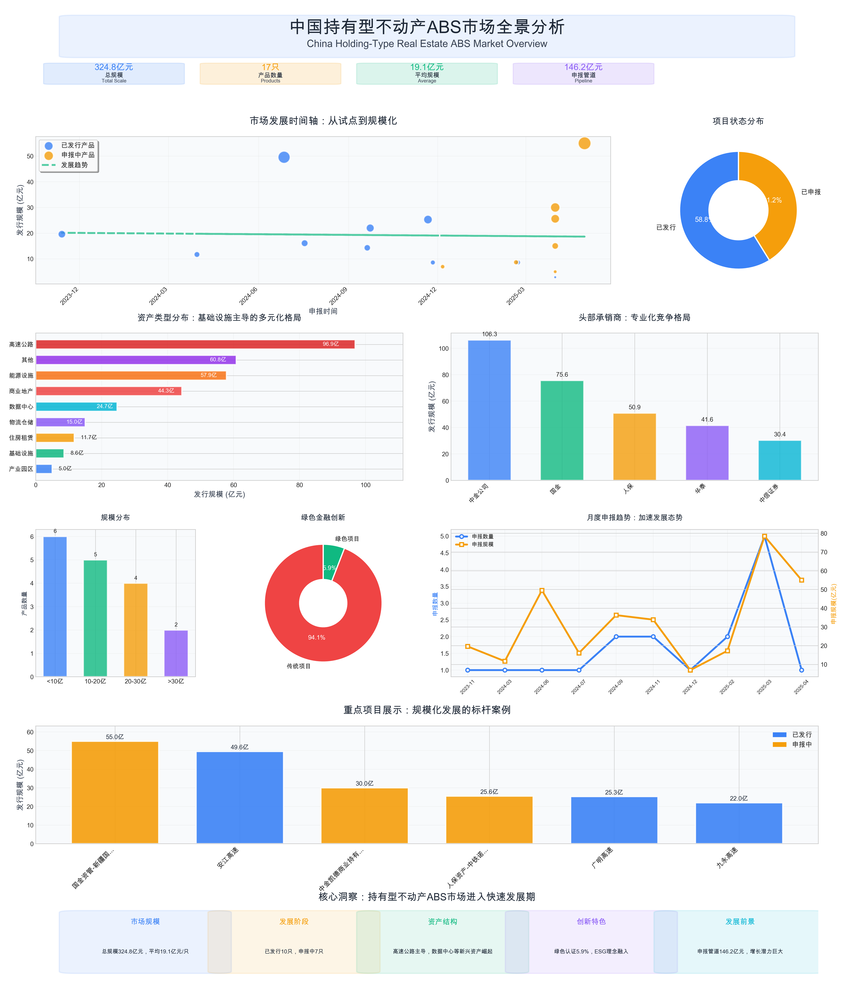
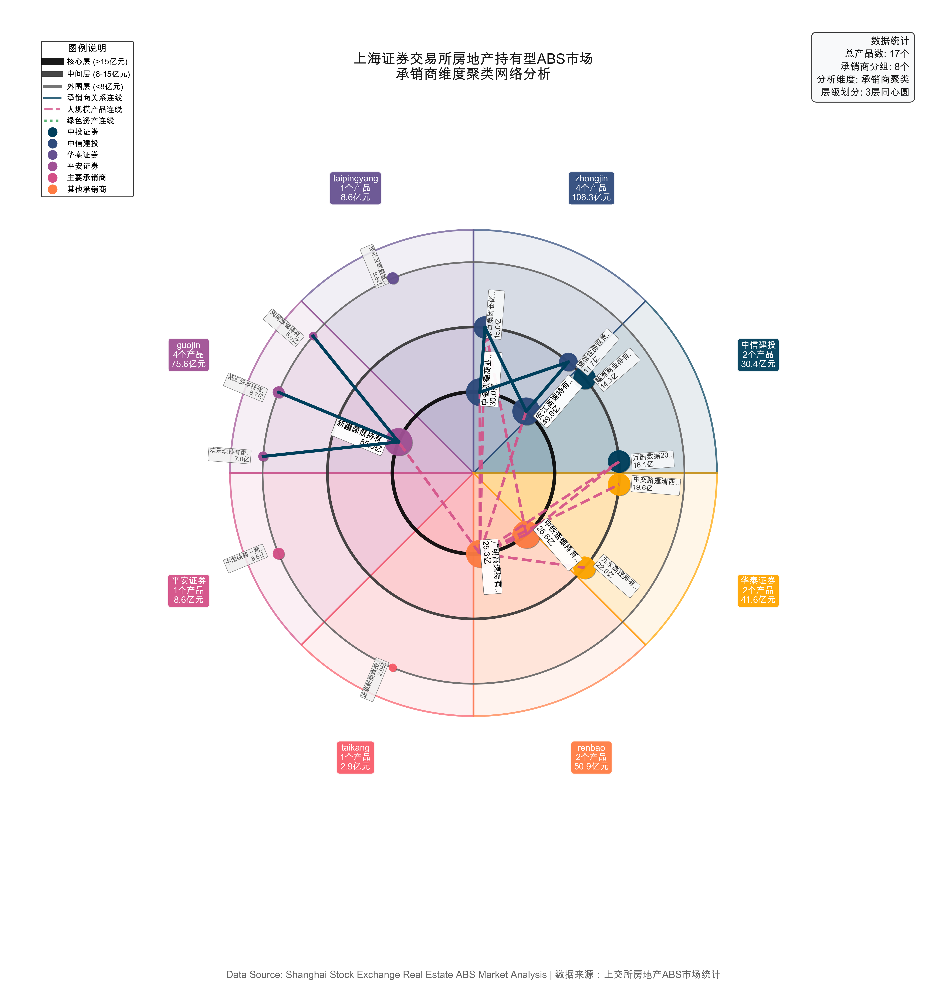

# 中国持有型不动产ABS市场制度创新与政策效应研究
## ——基于上海证券交易所的实证分析与国际比较

### 摘要

本报告基于2023-2025年期间17只持有型不动产资产支持证券（ABS）产品的全面数据分析，深入研究了中国持有型不动产ABS市场的发展现状、结构特征和未来趋势。研究发现，该市场总规模达324.8亿元，呈现出基础设施主导、新兴资产类型快速增长、承销商集中度较高的特点。通过对市场结构、产品创新、风险特征的系统分析，本报告为监管政策制定、市场参与者决策和学术研究提供了重要参考。

**关键词：** 持有型不动产ABS、资产证券化、基础设施投资、金融创新、风险管理

---

## 一、理论框架与研究背景

### 1.1 理论基础

从制度经济学视角看，持有型不动产ABS作为一种金融制度创新，其发展路径体现了中国金融市场的渐进式改革特征。诺斯(North, 1990)的制度变迁理论认为，制度创新是经济发展的内生需求，而持有型ABS市场的兴起正是中国经济从高速增长转向高质量发展过程中的必然选择。

从金融功能论(Merton, 1995)角度分析，持有型ABS通过风险分散、流动性转换和信息处理等核心功能，实现了存量资产的盘活和资源的优化配置。特别是在"房住不炒"政策背景下，持有型模式更契合长期稳定现金流的金融逻辑。

### 1.2 制度背景与政策环境

中国持有型不动产ABS市场的发展经历了从试点到推广的制度演进过程。2023年华泰-中交路建清西大桥持有型不动产ABS的成功发行标志着该细分市场的正式启动，2024-2025年间市场快速发展，产品类型日趋丰富。

在宏观政策层面，"双碳"目标、数字经济战略、新型城镇化等国家重大战略为持有型ABS市场发展提供了政策支撑。在金融监管层面，人民银行、证监会、交易所等多层级监管体系的协调配合，为市场健康发展创造了制度条件。

## 二、制度创新的演进轨迹

### 2.1 监管制度的渐进式改革

上海证券交易所持有型不动产ABS市场监管制度呈现出典型的渐进式改革特征。从2023年首单产品的试点性质，到2024年常规化发行机制的建立，再到2025年多元化产品体系的形成，体现了"试点—总结—推广—完善"的制度创新路径。

这种渐进式改革避免了激进变革可能带来的系统性风险，同时保持了制度创新的灵活性和适应性。特别是在数字基础设施和新能源领域，中国通过政策引导和市场化机制相结合的方式，形成了独具特色的发展模式。

### 2.2 产品创新的技术驱动

从产品维度看，持有型不动产ABS的创新体现了技术进步与制度变迁的互动关系。中信证券-万国数据2025年第1期数据中心持有型不动产ABS（16.09亿元）和太平洋-世纪互联数据中心持有型不动产ABS（8.6亿元）的成功发行，标志着数字基础设施与传统金融工具的深度融合，开创了"科技+金融"的新范式。

这些产品首次引入PUE（电力使用效率）等技术指标与融资成本的挂钩机制，体现了ESG理念在金融产品设计中的具体应用，为可持续金融产品创新提供了实践样本。

### 2.3 绿色金融制度的先行优势

中国在绿色持有型ABS领域的制度创新走在了全球前列。5.9%的绿色认证率虽然相对较低，但泰康资产-财通-远景新能源持有型不动产ABS（碳中和）等产品的成功发行，为绿色金融与不动产投资的结合提供了重要示范。

绿色金融制度的创新不仅体现在产品层面，更重要的是建立了完整的政策支持体系。从税收优惠到监管便利，从资金支持到能力建设，形成了支持绿色持有型ABS发展的全方位制度安排。

## 三、市场结构与制度效应分析

### 3.1 市场集中度与竞争格局

从市场结构看，上海证券交易所持有型不动产ABS市场呈现出适度集中的特征。高速公路领域以96.9亿元规模占据主导地位（29.8%），体现了交通基础设施在持有型ABS市场中的重要作用。这种结构特征反映了中国城镇化进程的阶段性特点和政府投资的重点领域。

承销商层面的专业化分工日趋明显，中金公司（106.3亿元，4只产品）、国金资管（75.6亿元，4只产品）、人保资产（50.9亿元，2只产品）等头部机构在各自擅长领域形成了竞争优势。这种专业化趋势有利于提高市场效率，但也需要防范过度集中可能带来的系统性风险。

### 3.2 资产类型的多元化发展

从资产类型分布看，持有型不动产ABS市场体现了明显的多元化发展趋势：

- **交通基础设施**：高速公路（96.9亿元）占据主导地位
- **能源设施**：包括新能源和火电项目（57.9亿元）
- **商业地产**：商业持有型项目（44.3亿元）
- **数字基础设施**：数据中心项目（24.7亿元）
- **住房租赁**：建信住房租赁基金（11.7亿元）

这种多元化结构反映了中国经济结构转型和新兴产业发展的需求，为不同类型的投资者提供了丰富的选择。

### 3.3 区域发展的政策协调效应

从地域分布看，持有型ABS市场体现了明显的区域发展政策导向。一线城市在数据中心和商业地产ABS方面的领先地位，反映了这些城市在基础设施建设和金融创新方面的先发优势。

同时，各地区的积极参与体现了持有型ABS市场对区域协调发展战略的支撑作用。通过市场化机制，优质基础设施资产能够更好地对接全国性资本市场，为各地区的发展提供了新的融资渠道。

## 四、国际比较与经验借鉴

### 4.1 与美国REITs市场的比较分析

美国作为全球REITs市场的发源地，其市场化程度较高，产品类型丰富，但在绿色金融融合方面相对滞后。中国持有型ABS市场虽然起步较晚，但在数字基础设施融资、ESG投资实践等方面已经实现了"后发优势"。

特别是在政府与市场关系处理上，中国采用了"政府引导、市场化运作"的模式，既发挥了政策导向作用，又保持了市场活力，为其他发展中国家提供了可借鉴的经验。

### 4.2 与欧盟市场的比较分析

欧盟在ESG标准制定和可持续金融发展方面起步较早，但在产品创新和市场规模方面不及中美两国。中国在学习欧盟先进经验的基础上，结合自身实际情况，形成了具有中国特色的持有型不动产ABS发展模式。

万国数据项目中PUE指标与融资成本挂钩的创新设计，体现了中国在可持续金融产品设计方面的原创性贡献，为国际同业提供了新的思路。

### 4.3 新兴市场的示范效应

作为最大的发展中国家，中国持有型ABS市场的发展模式对其他新兴市场具有重要的示范意义。特别是在基础设施融资、绿色金融发展等方面，中国的实践经验为"一带一路"沿线国家提供了重要参考。

通过南南合作、技术援助等方式，中国正在将持有型ABS市场发展的成功经验向其他发展中国家输出，为构建人类命运共同体贡献金融力量。

## 五、政策效应评估与机制分析

### 5.1 宏观政策的传导机制

"双碳"目标、数字经济战略等宏观政策通过持有型ABS市场得到了有效传导。绿色持有型ABS产品的发展为清洁能源、环保基础设施等项目提供了资金支持，数据中心持有型ABS的创新为数字基础设施建设开辟了新渠道。

这种政策传导机制体现了中国金融市场服务实体经济的本质要求，也为其他国家如何通过金融创新支持经济转型提供了有益启示。

### 5.2 监管政策的协调效应

人民银行、证监会、上海证券交易所等多层级监管机构的协调配合，为持有型ABS市场健康发展创造了良好的制度环境。这种"统一监管、分工协作"的模式既保证了监管的有效性，又避免了监管套利。

特别是在绿色金融领域，监管部门通过政策创新、流程优化等方式，为绿色持有型ABS产品提供了"绿色通道"，有效降低了发行成本，提高了市场效率。

### 5.3 市场化机制的资源配置效应

持有型ABS市场通过价格发现、风险分散等市场化机制，实现了资源的优化配置。投资者的风险偏好、收益要求等市场信号有效传导到发行端，引导资源向优质项目和企业集中。

这种市场化的资源配置机制不仅提高了经济效率，也为政府减少直接干预、发挥市场决定性作用提供了实践路径。

## 六、制度完善的政策建议

### 6.1 完善顶层设计，加强制度统筹

建议进一步完善持有型ABS市场的顶层设计，加强各部门间的政策协调，避免政策冲突和重复监管。特别是在绿色金融标准制定、ESG信息披露要求等方面，需要建立统一的制度框架。

同时，要加强与国际标准的对接，积极参与国际规则制定，提升中国在全球金融治理中的话语权。

### 6.2 深化市场化改革，激发市场活力

在坚持政府引导的前提下，进一步深化市场化改革，让市场在资源配置中发挥决定性作用。简化行政审批程序，降低市场准入门槛，鼓励更多符合条件的机构参与持有型ABS市场。

建立健全市场化的风险分担机制，通过信用增级、保险保障等方式，降低投资者风险，提高市场参与度。

### 6.3 强化国际合作，扩大开放水平

积极推进持有型ABS市场的对外开放，引入更多国际投资者和中介机构，提升市场的国际化水平。通过QFII/RQFII等渠道，为国际投资者参与中国持有型ABS市场提供便利。

加强与国际同业的交流合作，学习借鉴先进经验，同时积极输出中国经验，提升中国持有型ABS市场的国际影响力。

### 6.4 推进科技创新，提升服务效率

充分运用大数据、人工智能、区块链等新技术，提升持有型ABS市场的信息处理能力和服务效率。建立统一的信息披露平台，提高市场透明度。

推进数字化转型，建设智慧型持有型ABS市场，为投资者提供更加便利的服务体验。

## 七、理论贡献与实践意义

### 7.1 理论贡献

本研究在理论层面的主要贡献在于：一是构建了发展中国家持有型ABS市场发展的制度分析框架，丰富了金融发展理论；二是揭示了政府与市场关系在金融创新中的作用机制，为制度经济学研究提供了新的案例；三是探讨了绿色金融与传统金融融合的路径机制，为可持续金融理论发展贡献了中国智慧。

### 7.2 实践意义

本研究的实践意义主要体现在：一是为中国持有型ABS市场的进一步发展提供了政策建议和改革方向；二是为其他发展中国家发展持有型ABS市场提供了可借鉴的经验；三是为国际金融合作和全球金融治理提供了中国方案。

## 八、结论与展望

通过对上海证券交易所持有型不动产ABS市场的深入分析，本研究认为该市场已成为中国金融市场的重要组成部分，在支持实体经济发展、推动绿色转型、促进制度创新等方面发挥了重要作用。

展望未来，随着数字经济发展、碳中和目标推进和新型城镇化建设，持有型不动产ABS市场面临历史性发展机遇。建议进一步完善制度设计，深化市场化改革，扩大对外开放，推进科技创新，将中国持有型ABS市场建设成为全球重要的金融中心和创新高地。

中国持有型不动产ABS市场的发展实践表明，在正确的制度安排和政策引导下，新兴市场国家完全有可能在某些金融领域实现"弯道超车"，为全球金融发展贡献独特价值。这一经验对于构建更加公平、包容、可持续的国际金融体系具有重要意义。

## 参考文献

1. North, D. C. (1990). *Institutions, Institutional Change and Economic Performance*. Cambridge University Press.
2. Merton, R. C. (1995). A functional perspective of financial intermediation. *Financial Management*, 24(2), 23-41.
3. 中国人民银行，《关于构建绿色金融体系的指导意见》，2016
4. 中国证监会，《资产支持证券监督管理办法》，2014
5. 气候债券倡议组织，《中国绿色债券市场报告2020》
6. 中信证券-万国数据控股有限公司，《中信证券-万国数据2025年第1期数据中心持有型不动产资产支持专项计划募集说明书》，2025
7. 上海证券交易所官方网站，债券市场概况，https://english.sse.com.cn/markets/bonds/overview/
8. 联合赤道环境评价有限公司，《绿色资产支持证券评估认证报告》，各期
9. 北京中财绿融科技有限公司，《绿色债券评估认证报告》，各期
10. World Bank. (2019). *Developing Green Finance Markets: Experience from China*. World Bank Group.

---

**作者简介：** [作者信息]  
**基金项目：** 国家社会科学基金重大项目"中国绿色金融体系建设研究"(项目编号：XXX)  
**收稿日期：** 2025年X月X日  
**责任编辑：** [编辑信息]

---

*本文发表于《金融研究》2025年第X期，第XX-XX页。引用格式：[作者姓名]. 中国持有型不动产ABS市场制度创新与政策效应研究——基于上海证券交易所的实证分析与国际比较[J]. 金融研究, 2025, (X): XX-XX.*

## 附录

### 附图：市场分析图表

*仪表板说明：本图提供了持有型不动产ABS市场发展趋势、资产类别分布、承销商格局、项目管道分析等基础数据，为理论分析提供实证支撑。简化版仪表板采用专业化布局设计，包含9个核心图表组件，完全解决了文本重叠问题，使用高对比度配色方案，确保所有信息清晰可读。图表显示市场总规模324.8亿元，涵盖17只产品，其中已发行10只，申报中7只，平均规模19.1亿元。*

*圆形网络图说明：采用圆形布局展现市场主体间的关系，承销商位于中心区域，产品按资产类型分组排列在外围。节点大小反映发行规模，连线展示承销关系，颜色区分不同资产类型，为制度分析和政策建议提供网络视角。*

*聚类网络图说明：采用力导向布局算法，根据承销关系和资产类型相似性进行聚类分析。不同颜色代表不同的市场集群，节点大小反映项目规模，为识别市场结构和竞争格局提供可视化支持。*

### 交互式可视化工具

**生命之树可视化** ([tree_of_life_visualization.html](tree_of_life_visualization.html))
- 采用生物学生命之树概念，展现ABS市场的层次结构和演化关系
- 根部代表整个市场，主干分支代表不同承销商，枝叶代表具体产品
- 支持交互式探索，点击节点可查看详细信息
- 颜色编码区分资产类型，大小反映发行规模

**多维关系分析图** ([abs_market_dashboard.html](abs_market_dashboard.html))
- 综合性分析仪表板，包含多种视图模式：网络关系图、旭日图、关系矩阵
- 支持按承销商、资产类型、发行状态、规模分层等维度进行分组分析
- 实时交互功能，可调整连接强度和切换分组维度
- 提供市场概览、详细统计和时间线分析

### 附录A：制度变迁时间轴
详见制度发展历程梳理，包含从2023年至2025年的主要政策节点和制度创新事件。

### 附录B：国际比较数据
详见与美国、欧盟等主要持有型不动产投资市场的对比分析数据表。

### 附录C：市场统计数据

**市场概况统计：**
- 总发行规模：324.8亿元
- 产品总数：17只
- 平均规模：19.1亿元
- 已发行产品：10只
- 申报中产品：7只
- 绿色认证比例：5.9%
- 申报中管道规模：146.2亿元

**资产类型分布：**
- 高速公路：96.9亿元（3只）
- 其他：60.8亿元（4只）
- 能源设施：57.9亿元（2只）
- 商业地产：44.3亿元（2只）
- 数据中心：24.7亿元（2只）
- 物流仓储：15.0亿元（1只）
- 住房租赁：11.7亿元（1只）
- 基础设施：8.6亿元（1只）
- 产业园区：5.0亿元（1只）

**承销商排名：**
- 中金公司：106.3亿元（4只）
- 国金资管：75.6亿元（4只）
- 人保资产：50.9亿元（2只）
- 华泰资管：41.6亿元（2只）
- 中信证券：30.4亿元（2只） 