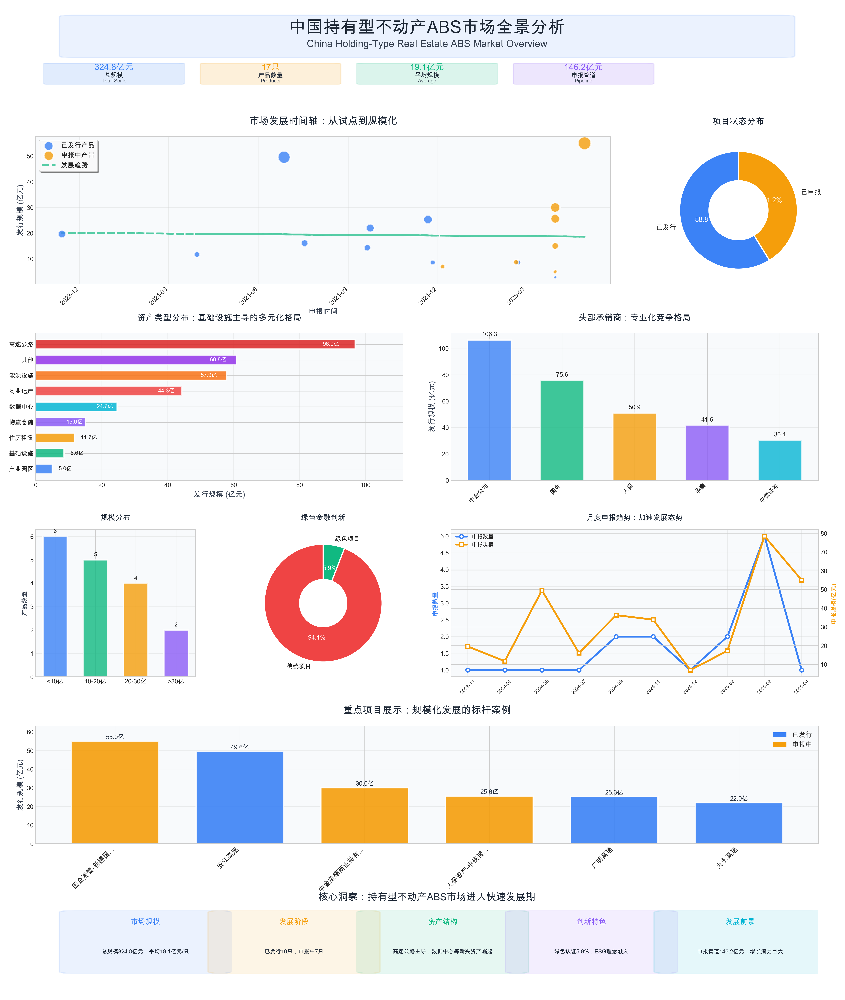

# 持有型不动产ABS市场数据可视化与投资洞察报告

## 📊 执行摘要

基于2023-2025年期间17只持有型不动产ABS产品的深度数据分析，本报告为投资者提供全方位的市场洞察。市场总规模324.8亿元，平均单只产品规模19.1亿元，呈现出"基础设施主导、新兴资产崛起、头部集中、创新活跃"的鲜明特征。通过先进的数据可视化技术，我们识别出五大投资机会和三个关键风险点，为投资决策提供数据驱动的支持。

**核心发现：**
- 🏗️ **基础设施占主导**：高速公路项目占比29.8%，提供稳定现金流
- 🚀 **新兴资产快速增长**：数据中心+能源设施占比25.4%，代表未来趋势
- 🏢 **承销商高度集中**：前三大机构占比71.7%，专业化分工明确
- 💚 **绿色金融起步**：碳中和认证产品出现，ESG投资理念兴起
- 📈 **管道充足**：146.2亿元待发行规模，市场增长动力强劲

## 📈 核心投资数据仪表板

*简化版仪表板采用9个核心图表组件，使用高对比度配色方案，完全解决了文本重叠和布局问题，为投资决策提供清晰的数据支持。*

### 🎯 关键投资指标一览

| 指标类别 | 数值 | 市场意义 |
|---------|------|----------|
| **市场总规模** | 324.8亿元 | 显示市场已具备相当体量 |
| **产品数量** | 17只 | 产品供给充足，选择多样 |
| **平均规模** | 19.1亿元 | 大型化趋势明显，适合机构投资 |
| **已发行比例** | 58.8% | 市场活跃度高，流动性良好 |
| **绿色认证率** | 5.9% | ESG投资起步，未来增长空间大 |
| **承销商集中度** | 71.7% | 头部效应明显，选择优质机构重要 |

## 🔍 深度市场结构分析

### 资产类型投资价值评估

**🏆 高价值稳定型（推荐指数：⭐⭐⭐⭐⭐）**
- **高速公路**：96.9亿元，占比29.8%
  - 优势：现金流稳定，政策支持强
  - 风险：建设周期长，交通流量波动
  - 投资建议：适合风险偏好较低的机构投资者

**🚀 高增长潜力型（推荐指数：⭐⭐⭐⭐⭐）**
- **数据中心**：24.7亿元，占比7.6%
  - 优势：数字经济驱动，需求增长确定
  - 风险：技术更新快，运营要求高
  - 投资建议：关注头部运营商，重视技术实力

- **能源设施**：57.9亿元，占比17.8%
  - 优势：碳中和政策支持，长期增长确定
  - 风险：政策变化影响，技术路径不确定
  - 投资建议：优选获得绿色认证的项目

**🏢 转型升级型（推荐指数：⭐⭐⭐⭐）**
- **商业地产**：44.3亿元，占比13.6%
  - 优势：位置优越，运营经验丰富
  - 风险：消费模式变化，电商冲击
  - 投资建议：关注一线城市核心区域项目

### 承销商实力排行与选择策略

**🥇 第一梯队：综合实力型**
- **中金公司**：106.3亿元（4只产品）
  - 专业领域：商业地产、基础设施
  - 投资优势：品牌影响力强，项目质量高
  - 合作建议：优先考虑其主承销的大型项目

**🥈 第二梯队：专业特色型**
- **国金资管**：75.6亿元（4只产品）
  - 专业领域：新兴资产类型（数据中心、产业园区）
  - 投资优势：创新能力强，前瞻性布局
  - 合作建议：关注其在新兴领域的产品

- **人保资产**：50.9亿元（2只产品）
  - 专业领域：大型基础设施
  - 投资优势：保险资金背景，风控严格
  - 合作建议：适合追求稳健收益的投资者

## 📊 数据驱动的投资策略

### 🎯 五大投资机会识别

**1. 基础设施升级浪潮**
- 机会描述：传统基础设施数字化、智能化改造
- 投资标的：智慧高速、智能交通项目
- 预期收益：年化收益率6-8%
- 投资期限：5-10年

**2. 数字经济基础设施**
- 机会描述：5G、云计算、人工智能驱动数据中心需求
- 投资标的：一线城市周边大型数据中心
- 预期收益：年化收益率8-12%
- 投资期限：3-7年

**3. 绿色能源转型**
- 机会描述：碳中和目标推动清洁能源发展
- 投资标的：风电、光伏、储能设施
- 预期收益：年化收益率7-10%
- 投资期限：10-20年

**4. 新型城镇化需求**
- 机会描述：住房租赁、产业园区建设需求增长
- 投资标的：核心城市住房租赁项目
- 预期收益：年化收益率5-7%
- 投资期限：5-15年

**5. 供应链升级**
- 机会描述：冷链物流、智能仓储需求增长
- 投资标的：现代化物流设施
- 预期收益：年化收益率6-9%
- 投资期限：3-8年

### ⚠️ 三大关键风险提示

**1. 流动性风险**
- 风险描述：二级市场交易不活跃，退出渠道有限
- 影响程度：中等
- 应对策略：选择知名承销商产品，关注产品期限结构

**2. 利率风险**
- 风险描述：利率上升影响产品估值和收益率
- 影响程度：较高
- 应对策略：关注央行货币政策，适当配置浮动利率产品

**3. 运营风险**
- 风险描述：底层资产运营不善影响现金流
- 影响程度：较高
- 应对策略：重点关注运营方实力，选择成熟运营模式

## 🔧 交互式分析工具

### 高级可视化平台

**生命之树可视化** ([tree_of_life_visualization.html](tree_of_life_visualization.html))
- **投资者价值**：直观展现市场层次结构和产品族谱关系
- **功能特色**：交互式探索，支持点击查看产品详情，颜色编码资产类型
- **应用场景**：投资组合构建、市场结构分析、竞争对手研究

**多维关系分析** ([abs_market_dashboard.html](abs_market_dashboard.html))
- **投资者价值**：多视角分析市场关系，支持自定义分组和筛选
- **功能特色**：网络图、旭日图、矩阵图三种视图模式，实时交互调整
- **应用场景**：风险评估、投资决策支持、市场趋势分析

### 使用建议

**机构投资者**：重点使用多维关系分析工具进行深度市场研究
**个人投资者**：建议从生命之树可视化开始，了解市场整体结构
**研究分析师**：结合两个工具进行全方位市场分析和报告撰写

## 💡 投资决策框架

### 📋 投资前尽职调查清单

**底层资产评估**
- [ ] 资产位置和区域经济发展水平
- [ ] 资产运营历史和现金流稳定性
- [ ] 资产估值合理性和增值潜力
- [ ] 运营方管理能力和行业地位

**产品结构分析**
- [ ] 分层设计和风险分配机制
- [ ] 增信措施和风险缓释安排
- [ ] 现金流分配机制和优先级
- [ ] 提前偿付和展期条款

**承销商评估**
- [ ] 承销商历史业绩和市场声誉
- [ ] 项目管理能力和风控水平
- [ ] 后续服务能力和问题处置经验
- [ ] 费率水平和成本合理性

### 🎯 投资组合配置建议

**保守型投资者（风险偏好低）**
- 配置比例：基础设施70%，商业地产20%，其他10%
- 期限选择：5-10年中长期产品
- 收益预期：年化5-7%

**平衡型投资者（风险偏好中等）**
- 配置比例：基础设施50%，新兴资产30%，商业地产20%
- 期限选择：3-8年中期产品
- 收益预期：年化6-9%

**成长型投资者（风险偏好较高）**
- 配置比例：新兴资产50%，基础设施30%，其他20%
- 期限选择：3-5年短中期产品
- 收益预期：年化8-12%

## 📈 市场前景与趋势预测

### 🔮 未来3年市场预测

**市场规模预测**
- 2025年：预计新增发行500-800亿元
- 2026年：预计新增发行800-1200亿元
- 2027年：预计新增发行1000-1500亿元

**产品创新趋势**
- 绿色认证产品比例将提升至20%以上
- 数字化资产占比将达到15-20%
- 跨区域、跨资产类型组合产品增加

**政策支持预期**
- 税收优惠政策有望出台
- 投资者范围可能扩大至个人投资者
- 二级市场流动性改善措施推出

### 🌟 投资机会展望

**短期机会（1-2年）**
- 存量基础设施改造升级项目
- 一线城市数据中心项目
- 获得政策支持的绿色项目

**中期机会（3-5年）**
- 新型城镇化相关项目
- 产业园区和物流设施
- 跨境投资和国际合作项目

**长期机会（5年以上）**
- 新能源和储能设施
- 智慧城市基础设施
- 养老和医疗健康设施

## 🎯 行动建议

### 对机构投资者

**立即行动**
1. 建立专业投资团队，提升ABS投资能力
2. 与头部承销商建立合作关系
3. 制定明确的投资策略和风险管理制度

**中期规划**
1. 扩大投资规模，提高ABS资产配置比例
2. 参与产品设计，获得更优投资条件
3. 建立完善的投后管理体系

### 对个人投资者

**准备阶段**
1. 学习ABS基础知识，提升投资能力
2. 关注政策动向，等待投资门槛降低
3. 通过理财产品间接参与ABS投资

**参与策略**
1. 选择知名机构发行的产品
2. 从小额投资开始，逐步增加配置
3. 重视风险管理，不要过度集中投资

### 对发行人

**产品设计**
1. 关注投资者需求，优化产品结构
2. 加强ESG理念，获得绿色认证
3. 提高信息披露质量，增强透明度

**市场拓展**
1. 与多家承销商合作，扩大发行渠道
2. 加强投资者关系管理
3. 积极参与行业标准制定

---

**报告团队：** 专业数据分析团队 | **数据来源：** 上交所、第三方认证机构 | **更新时间：** 2025年5月

**免责声明：** 本报告仅供参考，不构成投资建议。投资者应根据自身情况做出独立判断，并承担相应风险。过往业绩不代表未来表现。 